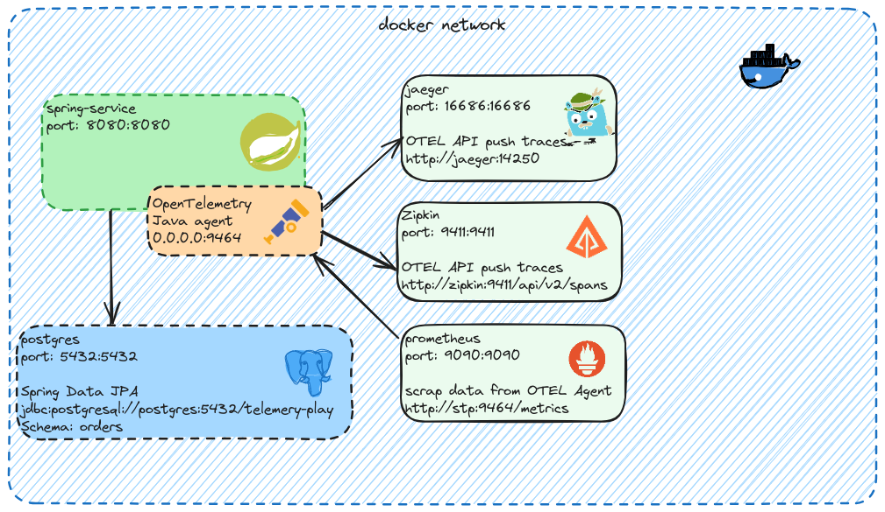

# Spring Telemetry Play

Welcome to Spring Telemetry Play, your go-to observability playground for exploring seamless OpenTelemetry integration within Spring Boot applications.

## Features
- Capture metrics, logs, and traces within a Spring-based application.
- Export observability data to popular platforms: Prometheus, Zipkin, Jaeger, Tempo, Loki, and Grafana.

## Architecture Diagram

## Getting Started
1. Clone the repository.
2. Follow the setup instructions in [docs/setup.md](docs/setup.md).
3. Explore the `src` directory for the Spring Boot application.

## Contributing
Contributions are welcome!
- Make a fork
- Create a branch with your feature: git checkout -b my-feature
- Commit changes: git commit -m 'feat: my new feature'
- Make a push to your branch: git push origin my-feature.
